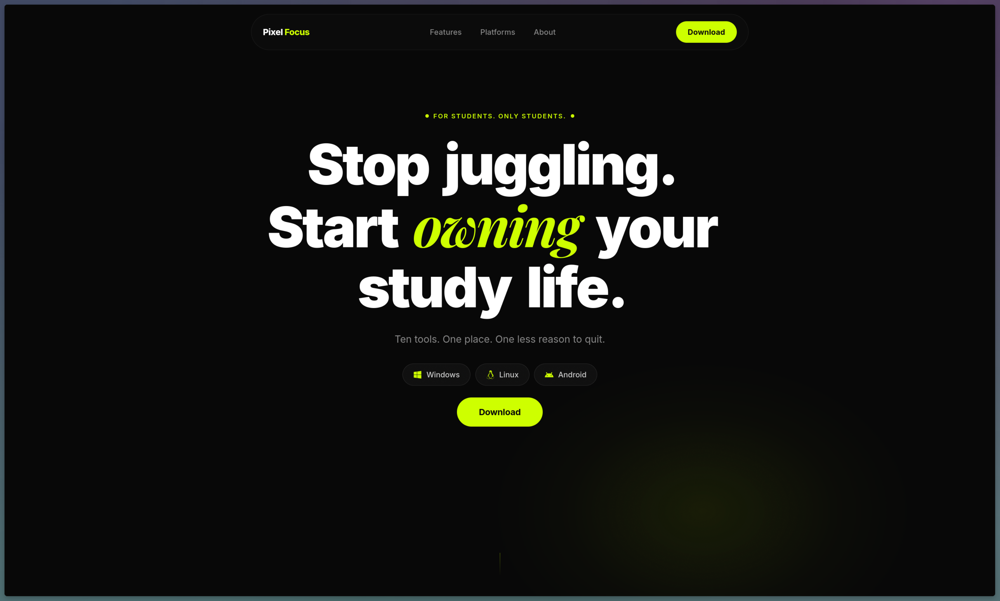
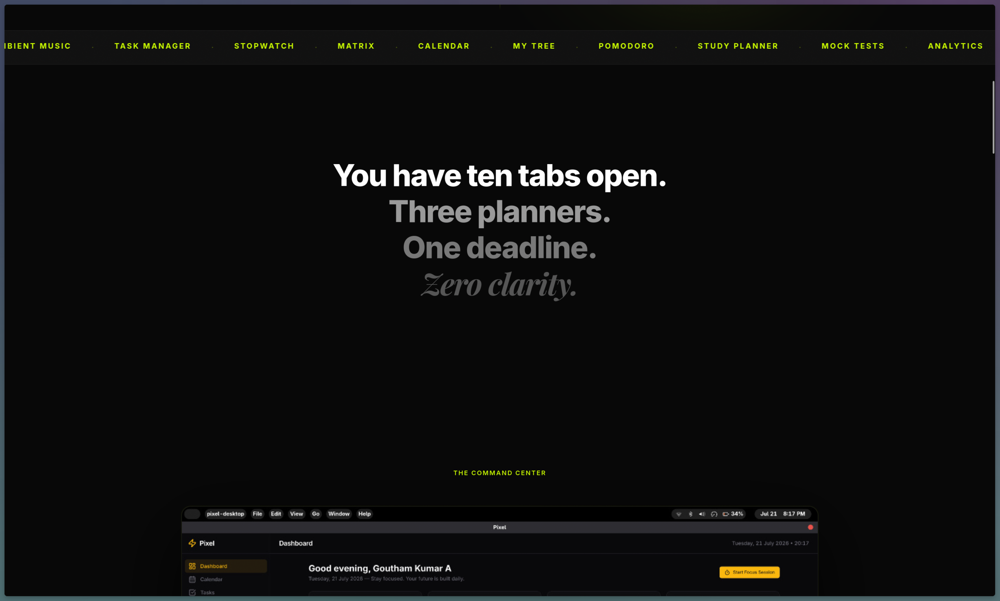
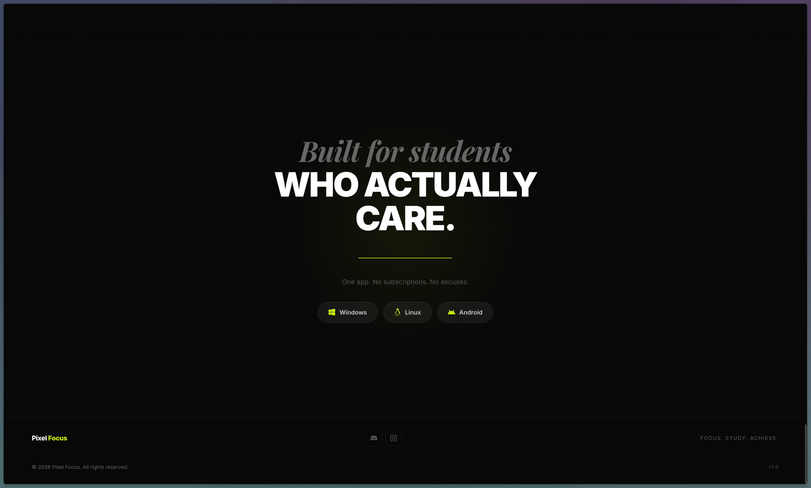

# Pixel Focus — Landing Page

The official marketing site for [Pixel Focus](https://pixel-focus-meow.vercel.app), a study productivity app for students. Built with React and Vite, deployed on Vercel.

[](https://pixel-focus-meow.vercel.app)
[](https://vite.dev)
[](https://react.dev)

---

## Overview

**Pixel Focus** is a cross-platform study productivity app that consolidates ten tools — dashboard, tasks, analytics, focus timer, notes, flashcards, mock tests, and ambient music — into a single offline-first experience. No subscriptions. One download.

This repository contains only the **landing page** that markets and links to the Pixel Focus desktop and mobile releases. It is not the application itself. The desktop and mobile application lives in a separate repository.

---

## Repository Scope

**This repository contains:**

- The Pixel Focus landing page (`artifacts/pixel-focus/`)
- A shared Express API server scaffold (`artifacts/api-server/`)
- Shared TypeScript libraries for API contracts, client hooks, and Zod schemas (`lib/`)
- Vercel deployment configuration (`vercel.json`)

**This repository does not contain:**

- The Pixel Focus desktop or mobile application source code
- The Electron or Tauri shell
- Backend services or user data storage
- The Android APK source

---

## Live Website

| Resource | URL |
|---|---|
| Production website | https://pixel-focus-meow.vercel.app |
---

## What the Landing Page Covers

The page is a single scrollable route that walks a visitor through six product areas:

| Section | Purpose |
|---|---|
| **Hero** | Headline, platform download pills, primary CTA |
| **Ecosystem** | Feature showcase — six cards with in-app screenshots |
| **Platforms** | Download cards for Windows, Linux, and Android |
| **The Promise** | Brand statement and product positioning |
| **Donate** | Razorpay link for one-time support |
| **Footer** | Navigation and links |

The navbar hides on scroll-down and reappears on scroll-up. All navigation links use smooth-scroll to page anchors — there are no secondary routes beyond a 404 fallback.

### Showcased application features

These are the Pixel Focus product features the landing page describes and illustrates. They exist in the application, not this repository:

- **Dashboard** — study time, tasks, streaks, and today's schedule on one screen
- **Tasks** — filterable to-do list by subject, priority, and deadline
- **Analytics** — per-subject and per-week study hour breakdown with a 28-day heatmap
- **Focus Timer** — Pomodoro sessions up to 90 minutes, or raw stopwatch, both writing to the same analytics
- **Mock Tests** — practice test log with per-subject score tracking over time
- **Ambient Music** — nine built-in offline sounds, plus YouTube URL support

---

## Screenshots

> Add screenshots of the live landing page here. Recommended dimensions: 1440×900 for desktop, 390×844 for mobile.

## Screenshots

### Hero



### Features / Marquee



### Footer



## Technology Stack

| Category | Technology | Notes |
|---|---|---|
| Framework | React 18 | Client-rendered SPA |
| Language | TypeScript 5.9 | Strict mode |
| Build tool | Vite 6 | esbuild + Rollup bundler |
| Styling | Tailwind CSS v4 | Config-free, via `@tailwindcss/vite` plugin |
| Animation | Framer Motion | Page-level and component-level animations |
| Component primitives | Radix UI / shadcn/ui | Accessible, unstyled base components |
| Client-side routing | Wouter | Lightweight; single route in production |
| Data fetching | TanStack React Query | Available but not used by the landing page |
| Package manager | pnpm (workspace) | Monorepo with catalog version pins |
| Deployment | Vercel | Static output, CDN-served |
| Typography | Inter + Playfair Display | Loaded from Google Fonts |

---

## Repository Structure

```
pixelFocusLandingPage/
├── artifacts/
│   ├── pixel-focus/            # Landing page — primary artifact
│   │   ├── src/
│   │   │   ├── assets/         # Static images (app screenshots)
│   │   │   ├── components/
│   │   │   │   ├── ui/         # shadcn/ui base components
│   │   │   │   ├── AppReveal.tsx
│   │   │   │   ├── Donate.tsx
│   │   │   │   ├── Ecosystem.tsx
│   │   │   │   ├── Footer.tsx
│   │   │   │   ├── Hero.tsx
│   │   │   │   ├── Marquee.tsx
│   │   │   │   ├── Navbar.tsx
│   │   │   │   ├── Platforms.tsx
│   │   │   │   ├── Problem.tsx
│   │   │   │   └── ThePromise.tsx
│   │   │   ├── hooks/          # Custom React hooks
│   │   │   ├── lib/            # Utilities (cn, etc.)
│   │   │   ├── pages/
│   │   │   │   ├── LandingPage.tsx   # Single page that composes all sections
│   │   │   │   └── not-found.tsx     # 404 fallback
│   │   │   ├── App.tsx         # Router and query client setup
│   │   │   ├── index.css       # Tailwind imports, theme tokens, Google Fonts
│   │   │   └── main.tsx        # React root mount
│   │   ├── index.html          # Entry point; contains all SEO meta tags
│   │   ├── package.json
│   │   ├── tsconfig.json
│   │   └── vite.config.ts
│   ├── api-server/             # Express API server (not used by landing page)
│   └── mockup-sandbox/         # Design prototyping environment
├── lib/
│   ├── api-client-react/       # Generated React Query hooks
│   ├── api-spec/               # OpenAPI spec and Orval codegen config
│   ├── api-zod/                # Generated Zod schemas
│   └── db/                     # Drizzle ORM schema (not used by landing page)
├── scripts/                    # Workspace utility scripts
├── vercel.json                 # Vercel build and rewrite config
├── package.json                # Root workspace config and shared dev tools
├── pnpm-workspace.yaml         # Package discovery and version catalog
└── tsconfig.base.json          # Shared TypeScript compiler options
```

Each section of the landing page maps to a single component file in `src/components/`. `LandingPage.tsx` composes them in order — adding a section means importing and placing it there.

---

## Getting Started

### Prerequisites

- [Node.js](https://nodejs.org/) 20 or later
- [pnpm](https://pnpm.io/) 9 or later

```bash
npm install -g pnpm
```

### Installation

```bash
git clone https://github.com/pixelGoutham/pixelFocusLandingPage.git
cd pixelFocusLandingPage
pnpm install
```

### Running locally

```bash
pnpm --filter @workspace/pixel-focus run dev
```

The dev server starts on the port assigned by the `PORT` environment variable, defaulting to `3000`. Open [http://localhost:3000](http://localhost:3000).

### Building

```bash
pnpm --filter @workspace/pixel-focus run build
```

Output lands in `artifacts/pixel-focus/dist/public/`. This is the directory Vercel serves.

### Preview the production build

```bash
pnpm --filter @workspace/pixel-focus run serve
```

### Type checking

```bash
pnpm --filter @workspace/pixel-focus run typecheck
```

To check every package in the workspace:

```bash
pnpm run typecheck
```

---

## Development Workflow

### Working on the landing page

All page content lives in `artifacts/pixel-focus/src/`. Each visual section of the page is an isolated component. The general pattern:

1. Create or edit the component in `src/components/`.
2. Import and place it in `src/pages/LandingPage.tsx`.
3. Verify locally with the dev server.
4. Push to `main` — Vercel deploys automatically.

### Code style

The project uses TypeScript in strict mode. There is no ESLint configuration committed to the repository; formatting conventions follow standard TypeScript and React idioms. Tailwind utilities are preferred over custom CSS where possible.

### Branch strategy

The repository has a single branch (`main`). Every push to `main` triggers a production deployment on Vercel. For significant changes, open a pull request to get a Vercel preview deployment before merging.

---

## Deployment

The site is deployed on Vercel as a static SPA.

**`vercel.json` configuration:**

```json
{
  "installCommand": "pnpm install",
  "buildCommand": "pnpm --filter @workspace/pixel-focus run build",
  "outputDirectory": "artifacts/pixel-focus/dist/public",
  "framework": null,
  "rewrites": [
    { "source": "/(.*)", "destination": "/" }
  ]
}
```

| Setting | Value |
|---|---|
| Install command | `pnpm install` |
| Build command | `pnpm --filter @workspace/pixel-focus run build` |
| Output directory | `artifacts/pixel-focus/dist/public` |
| Framework | None (custom static) |
| Production branch | `main` |

**Preview deployments:** Every pull request to `main` gets a unique preview URL from Vercel. The `BASE_PATH` environment variable defaults to `/` in Vercel deployments, so all asset paths resolve from the root.

**Replit environment:** When running on Replit, `BASE_PATH` is set by the platform to a sub-path. The `vite.config.ts` reads this variable and passes it as Vite's `base` option, keeping the same build script compatible with both environments.

---

## SEO

The landing page is a client-rendered SPA. All meta tags, Open Graph tags, and Twitter Card tags are defined statically in `artifacts/pixel-focus/index.html`.

To update page title, description, or social sharing previews, edit the relevant `<meta>` tags in that file. Because the page is client-rendered, search engine indexing depends on crawlers that execute JavaScript (Googlebot does; others vary).

There is no `robots.txt` or XML sitemap committed to the repository. Vercel serves the page with standard crawl permissions by default.

---

## Performance

Performance is primarily a function of the Vite build pipeline and Vercel's CDN:

- **Code splitting** — Vite/Rollup splits vendor and application code automatically.
- **Asset hashing** — All static files (scripts, images) receive content-based hashes, enabling long-lived cache headers.
- **Minification** — esbuild minifies JavaScript; Rollup handles chunk optimization.
- **Font loading** — Inter and Playfair Display are loaded from Google Fonts in `index.css`. Both use `display=swap` to prevent invisible text during load.
- **Static delivery** — Vercel serves the output directory from its global edge network with no origin server round-trip.

Images in `src/assets/` are bundled by Vite and receive the same hashing treatment as other static assets.

---

## Accessibility

The page uses semantic HTML landmarks (`<nav>`, `<main>`, `<footer>`) and Radix UI primitives for interactive elements, which ship with appropriate ARIA roles and keyboard navigation built in. Scroll-behavior and entrance animations are implemented with Framer Motion; reduced-motion support has not been explicitly verified against `prefers-reduced-motion` in the current codebase.

---

## Design Philosophy

The visual language is built around a few deliberate constraints:

- **Dark background** — Near-black (`#0a0a0a`), consistent across all sections, without gradient fills or photographic backgrounds.
- **Single accent** — `#CDFF00` (yellow-green) is used exclusively for primary CTAs and interactive highlights. Nothing else uses that hue.
- **Typographic contrast** — Playfair Display (serif, weighted) for display headings; Inter (sans-serif) for all body copy and UI labels. The combination creates hierarchy without needing size alone.
- **Numbered sections** — The Ecosystem feature cards (`01` through `06`) use a zero-padded index as the primary identifier, not icons or color coding.
- **Motion with restraint** — Framer Motion handles entrance animations and the auto-hiding navbar. Animations are present but not decorative; they serve orientation, not attention.

The overall target is a page that reads as a product, not a template.

---

## Contributing

This is a personal project. Contributions are welcome for bug fixes and accessibility improvements.

1. Fork the repository.
2. Create a branch: `git checkout -b fix/issue-description`.
3. Make your changes and verify locally.
4. Open a pull request against `main` with a clear description of what changed and why.

For larger changes — new sections, redesigns, structural refactors — open an issue first to discuss before investing time in the implementation.

---

## Roadmap

Realistic near-term improvements for this landing page:

- Add `robots.txt` and a `sitemap.xml` to improve crawlability.
- Audit and implement `prefers-reduced-motion` for all Framer Motion animations.
- Replace Google Drive download links with a proper release page or CDN once distribution infrastructure is in place.
- Add macOS and iOS platform cards when those builds ship.
- Implement an Open Graph image for consistent link previews across social platforms.
- Evaluate whether static site generation (SSG) or a meta framework would improve SEO compared to the current client-rendered approach.

---

## License

_(License to be added)_

---

## Acknowledgements

- [Radix UI](https://www.radix-ui.com/) for accessible component primitives
- [shadcn/ui](https://ui.shadcn.com/) for the component scaffold
- [Framer Motion](https://www.framer.com/motion/) for animation primitives
- [Vercel](https://vercel.com/) for hosting
- Everyone who downloaded Pixel Focus and sent feedback
